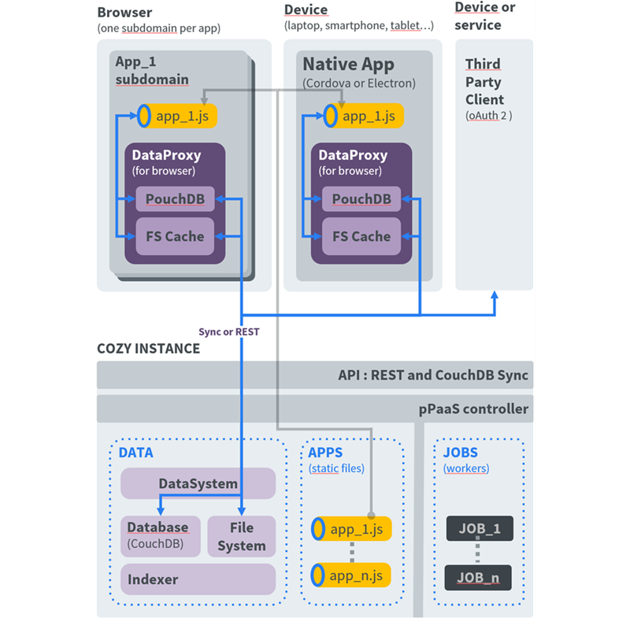

# Introduction

Cozy is a personal server hosting applications that allow collect and manipulate all your personal data.

There are two kind of applications:

 - **web applications**: that's Single Page Applications (SPA) written in HTML and JavaScript that run inside the user's browser. They interact with the server through its API. This API allows to manipulate data and files and to perform miscellaneous tasks, like send emails
 - **connectors**: that's small application written in JavaScript, running on the server side, that import your data from remote sources.

In this tutorial, you'll learn how to [write a client application](app.md) and [a connector](konnector.md).

## Architecture

Several layers can be distinguished. From inside to outside:

 - the core is a database that store all user data;
 - the database is accessible through a layer that control accesses and expose a REST API;
 - Web applications and other clients offer nice user interfaces to interact with the data.

One of our motto is « Cozy is Simple, Versatile, Yours ». This applies to our architecture:

 - *simple* and easy to understand and deploy. Cozy doesn’t require to setup and manage a lot of micro-services;
 - *versatile*: our server is comfortable anywhere. You can host a single instance on a small Raspberry π at home, or a cluster of thousands instances on dedicated servers inside a datacenter;
 - *yours*: the users are the owners of their data, they keep the control. They can migrate their data from one server to another, and are not dependant from a single hosting provider. As we say: “you will stay because you can leave”;

### The server

The server consist of a single process. We call it *the Cozy stack*. It provides services through a REST API that allow to:

 - create, update, delete documents inside the database;
 - send emails;
 - launch jobs on the server. Connectors that import data from remote websites are some sort of jobs. Jobs can be one time tasks (sending a message) or periodic tasks. Some jobs, like the connectors, that require executing third party code on the server side, are sandboxed (we user `nsjail` for now).
 - …

The server also allow to access the database replication API, allowing to sync documents between the server and local databases, for example in mobile clients.

Two authentication methods are available:

 - Web applications running on the server get a session token when the user log in;
 - OAuth2 for other applications.

The server is in charge of serving the Web applications users have installed from the application store.

### The database

CouchDB is a document database. Everything, from user data to server settings, is stored inside typed documents, identified by an unique id.

Two request methods are allowed: map-reduce or `Mango`, a specific query language.

Every document has a `doctype`, and we keep an index of the definition of every doctype.

Binary data are stored outside the database. Depending on the server configuration, they may be stored on a file system or a dedicated object storage like `swift`.

The *datasystem* layer inside the Cozy stack is in charge of controlling access rights on documents and binaries. It allows fine gained access control, on a whole doctype or on a set of documents.

### The applications

The server provide services to applications:

 - real time notifications of events;
 - methods allowing applications to communicate and share data;
 - methods allowing sharing of documents between servers.

#### Application store

An application registry lists every available applications, and their characteristics. Each application can:

 - create its own doctypes;
 - request permission to access documents;
 - offer services to other applications;
 - register publics routes;
 - create jobs that will be run on server side.

### Security

Each application uses its own sub-domain name, so it gets sandboxed inside the browser: other application are not able to steal it access token and access its data.

We use *Content Security Policy* to control what the application is allowed to do. For example, Web applications running inside Cozy are not allowed to send requests to other websites. This allow a strict control over applications, preventing them to leak your data.

