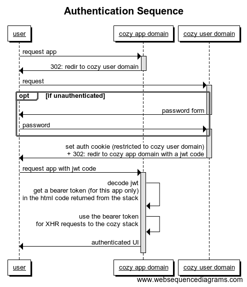

## Authentication Sequence

1. The User opens up a browser to check his cozy, using his *cozy app domain* (`user-home.mycozy.cloud/`, or `user-drive.mycozy.cloud/`, or ...)
2. (s)he's redirected to his *cozy user domain* (`user.mycozy.cloud`)
3. The browser requests the stack through *cozy user domain*, which sends back the authentication form. The user fills his password, sending it back to the  *cozy user domain*
<<<<<<< HEAD
4. The server *cozy user domain* sets an auth cookie for *cozy user domain* ONLY. This cookie is restricted to this sub-domain (and httpOnly). It will not be seen by the app domain. This is by design, so that an app could not use the cookie and authenticate with another app permission.
5. A redirect status response code (302) for the *requested app domain* (`user-home.mycozy.cloud/`, or `user-drive.mycozy.cloud/`, or ...) is sent to the browser. (The 302 redirection from *cozy user domain* to the *requested app domain* adds a ?code=xxxxx to the URL where xxxx is a random code, used to create a new cookie on the *cozy app domain*
6.The new cookie is created on *requested app domain*. The app can now fetch its index.html page with a [JWT token](https://jwt.io/) inside it, and extracts it in JS
7. The jwt token is sent back to the stack, on the *cozy user domain* as a bearer token in the Authorization header of HTTP requests.
8. *cozy app domain* uses the bearer token to communicate with the stack through XHR request
9. *cozy app domain* sends back the authenticated UI to the browser, and a new cookie for the *cozy app domain* (`user-home.mycozy.cloud/`, or `user-drive.mycozy.cloud/`, or ...)
=======
4. The server *cozy user domain* sets an auth cookie for *cozy user domain* ONLY
5. A redirect status response code (302) for the requested app domain (`user-home.mycozy.cloud/`, or `user-drive.mycozy.cloud/`, or ...) is sent to the browser
5. The browser requests the *cozy app domain* with a [jwt code](https://jwt.io/)
6. The jwt code  is checked and decoded through the stack, which sends back a bearer token in the request header to *cozy app domain*
7. *cozy app domain* uses the bearer token to communicate with the stack through XHR request
8. *cozy app domain* sends back the authenticated UI to the browser, and a new cookie for the *cozy app domain* (`user-home.mycozy.cloud/`, or `user-drive.mycozy.cloud/`, or ...)
>>>>>>> d8565b7a7fef9eb08212f0c6877a71f5ab209e1b

For each new app requested by the user, repeat steps
(Steps 3 & 4 only happens when the user is not authenticated at all: meaning there is no auth cookie for *cozy user domain* )

## Authentication types

### Password

- Used by the user on the authentication form on the *cozy user domain* (`user.mycozy.cloud`)
- It can be changed through the setting apps
- It can be reset on the authentication form or in the setting app, by sending an email to the user

When the password changes, all the old cookies are invalidated, and a new one is created for the current session. Meaning the user will need to login again in their other browsers/clients.

### Cookies

- For each app, there is a specific cookie, meaning there is a new cookie for each new domain/sub-domain
- The "Remember me" check box only affect the expiration date of the *cozy user domain* cookie

 !!! warning ""
     - local dev servers (`cozy.tools`), selfHost server and Gandi server use sudomains: `home.user.cozy`
     - dev servers (`cozy.wtf`), integration servers (`cozy.works`), staging servers (`cozy.rocks`) and production server (`mycozy.cloud`) use different domains `user-home.cozy...`

### 2FA

- Can be activated by the user
- Only works through emails right now
- Once 2FA activated, and the user authenticated, a new checkbox "Trust this machine" creates a new cookie (if checked)

 !!! warning ""
     There are a few timing issues with 2FA, as the code validation time is quite short, and some emails may be delayed.

### Usecases and their authentication methods

- User: password and Cookies
- App (drive, photo, home...): Cookie and Authorization Bearer Token
- Client (desktop, mobile...): OAuth and Authorization Bearer Token
- Connectors: Authorization Bearer Token
- Share: OAuth and Authorization Bearer Token (just like the desktop client)
