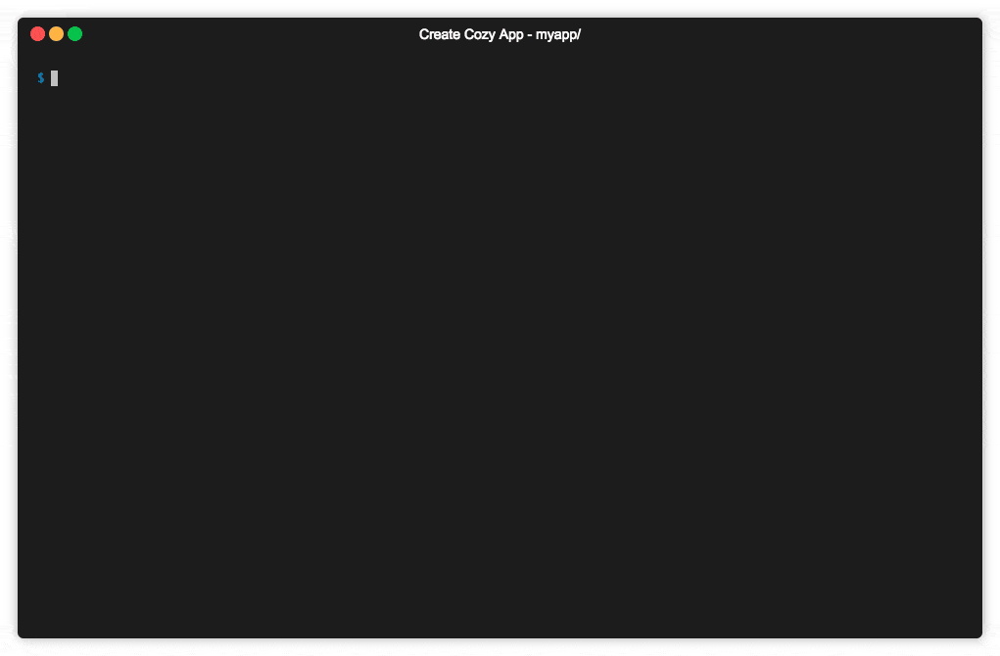

## Prerequisites

Developing an application for Cozy is quite easy. All you need to have is:

 - NodeJS 8+
 - [Yarn](https://yarnpkg.com): a NodeJS package manager, like `npm`
 - Docker to have a Cozy for dev
 - Some basics about developing a single page application in HTML/JS or you just want to learn :)

## Install the development environment

The only tool required to have a Cozy for development is Docker.

- [Install Docker for OSX][docker-osx]{:target="_blank"}
- [Install Docker for Windows][docker-windows]{:target="_blank"} (We have been told that installing Docker on some familial flavours of Windows may be a bit difficult. It has not been tested yet for this documentation.)
- Install Docker for GNU/linux: [Ubuntu][docker-ubuntu]{:target="_blank"} / [Fedora][docker-fedora]{:target="_blank"} / [Debian][docker-debian]{:target="_blank"} / [CentOs][docker-centos]{:target="_blank"}

!!! warning ""
    On GNU/Linux, according [to the documentation](https://docs.docker.com/engine/installation/linux/linux-postinstall/): « The docker daemon binds to a Unix socket instead of a TCP port. By default that Unix socket is owned by the user root and other users can only access it using sudo. If you don’t want to use sudo when you use the docker command, create a Unix group called docker and add users to it. Be warned that the docker group grants privileges equivalent to the root user. You should have a look at [Docker’s documentation on security](https://docs.docker.com/engine/security/security/).


Every application running inside Cozy is a client-side HTML5 application interacting with your data through the API of the server. To develop an application, you’ll require a running Cozy server.

The easiest way is to use the Docker image for developers we provide.

Just install it:

```sh
docker pull cozy/cozy-app-dev
```

!!! note "Note"
    We update this image on a regular basis with the latest version of the server and our library. Don’t forget to update the image by running `docker pull cozy/cozy-app-dev` from time to time to keep your Cozy dev up to date.


## Create your application

You can boostrap your application from scratch if you want, but we highly recommand to use our dedicated community tool [`create-cozy-app`](https://github.com/CPatchane/create-cozy-app) to bootstrap very easily a Cozy application for you.

<div align="center">
  
</div>

This tool will generate an application using React, the framework we internally use in the Cozy Front team. But [options](https://github.com/CPatchane/create-cozy-app#options) are available if you want to use other frameworks.

To do so, run directly `create-cozy-app` without installing it globally by using the `yarn create cozy-app` command to bootstrap your application:

```
yarn create cozy-app mycozyapp
```

The script will download some dependencies (may take a while) and ask you a few questions, then create an application skeleton inside `mycozyapp`. Here is a quick demo of what's happening:

<div align="center">
  
</div>

That's it! You can already start hacking:

```
cd mycozyapp
yarn start
```

After the webpack build and the Cozy inside Docker is started, the app `mycozyapp` app should be available at `http://mycozyapp.cozy.tools:8080` (the password is `cozy`), as noticed by the output:

<div align="center">
  
</div>


---


## Going Further

### What is `cozy.tools` ?

You may see in our documentation that we use `*.cozy.tools` as domain for the local Cozy. Since Cozy uses subdomains to serve the applications, we can't use directly `localhost` as it.

We have just parameterized this `*.cozy.tools` domain to always redirect to `127.0.0.1`, your local computer address.
With that, no need to configure your environment to set extra local hosts for development anymore.

### How the application works?

The minimal application consist of only two files:

 - an HTML file, `index.html`, with the markup and the code of your application
 - a manifest describing the application. It’s a JSON file named `manifest.webapp` with the name of the application, the permissions it requires… We’ll have a deeper look to it content later.

Your application requires some informations to interact with the server API, for example the URL of its entrypoint, and an auth token. This data will be dynamically injected into `index.html` when it serves the page. So the `index.html` file has to contain some string that will be replaced by the server. The general syntax of this variables is `{{…}}`, so don’t use this syntax for other purpose in the page, for example inside comments.

You can use the following variables:

 - `{{.Domain}}` will be substituted by the URL of the API entrypoint
 - `{{.Token}}` will be replaced by a token that authenticate your application when accessing the API
 - `{{.Locale}}`: the lang f the instance
 - `{{.AppName}}`: the name of the application
 - `{{.AppNamePrefix}}`: the name prefix of the application
 - `{{.AppSlug}}`: the slug of the application
 - `{{.AppEditor}}`: the editor of the application
 - `{{.IconPath}}` will be replaced by HTML code to display the *favicon*
 - `{{.CozyClientJS}}` will be replaced with HTML code to inject the Cozy client library (old Cozy client)
 - `{{.CozyBar}}` will be replaced with HTML code to inject the upper menu bar.

This allows to get this kind of `index.html`:

```html
<!DOCTYPE html>
<html lang="{{.Locale}}">
  <head>
    <meta charset="utf-8">
    <title>My Awesome App for Cozy</title>
    <link rel="stylesheet" src="my-app.css">
    {{.CozyClientJS}}
    {{.CozyBar}}
    <script defer src="my-app.js"></script>
    <meta name="viewport" content="width=device-width, initial-scale=1">
  </head>
  <body>
    <div role="application" data-cozy-token="{{.Token}}" data-cozy-stack="{{.Domain}}">
    </div>
  </body>
</html>
```


### Read the application manifest

Each application must have a “manifest”. It’s a JSON file named `manifest.webapp` stored at the root of theapplication directory. It describes the application, the type of documents it uses, the permissions it requires…

Here’s a sample manifest:

```json
{
  "name": "My Awesome application",
  "name_prefix": "",
  "slug": "myapp",
  "permissions": {
    "apps": {
      "type": "io.cozy.apps"
    },
    "permissions": {
      "type": "io.cozy.permissions"
    },
    "settings": {
      "type": "io.cozy.settings"
    },
    "sample": {
      "type": "io.cozy.dev.sample",
      "verbs": ["GET", "POST", "PUT", "PATCH", "DELETE"]
    },
    "jobs": {
      "type": "io.cozy.jobs"
    }
  },
  "routes": {
    "/": {
      "folder": "/",
      "index": "index.html",
      "public": false
    },
    "/public": {
      "folder": "/public",
      "index": "index.html",
      "public": true
    }
  }
}
```

#### Permissions

Applications require permissions to use most of the APIs. Permissions can be described inside the manifest, so theserver can ask the user to grant them during installation. Applications can also request permissions at run time.

A permission must at type contain a target, the type of objects the application want to interact with. Can be a document type, or an action on the server. By default, all grant on this object are granted, but we can also request fine grained permissions, for example limiting to read access. We can also limit the scope to a subset of thedocuments.

In the manifest, each permission is an object, with a random name and some properties:
  - `type`: **mandatory** the document type or action name
  - `description`: a text that will be displayed to the user to explain why the application require this permission
  - `verbs`: an array of HTTP verbs. For example, to limit permissions to read access, use `["GET"]`
  - `selector`: a document attribute to limit access to a subset of documents
  - `values`: array of allowed values for this attribute.

An application can request a token that grant access to a subset of its own permissions. For example if the application has full access to the files, it can obtain a token that give only read access on a file. Thus, the application can make some documents publicly available. The public page of the application will use this token asauthentication token when accessing the API.

##### Samples

Application require full access to files:

```json
{
  "permissions": {
    "files": {
      "description": "…",
      "type": "io.cozy.files"
    },
  }
}
```

Application want to be able to read the contact informations of `cozy@cozycloud.cc`

```json
{
  "permissions": {
    "contact": {
      "type": "io.cozy.contacts",
      "verbs": ["GET"],
      "selector": "email",
      "values": ["cozy@cozycloud.cc"]
    }
  }
}
```

#### Routing

The application must declare all of its URLs (routes) inside the manifest. A route is an object associating an URL toan HTML file. Each route has the following properties:

  - `folder`: the base folder of the route
  - `index`: the name of the file inside this folder
  - `public`: a boolean specifying whether the route is public or private (default).

Sample:

```json
"routes": {
  "/admin": {
    "folder": "/",
    "index": "admin.html",
    "public": false
  },
  "/public": {
    "folder": "/public",
    "index": "index.html",
    "public": true
  },
  "/assets": {
    "folder": "/assets",
    "public": true
  }
}
```

### Behind the magic

Some server APIs may not be available right now through the library. If you want to use one of this method, you’llhave to call it manually. We’ll describe here how to access the API without using the Cozy Client library.

Connecting to the API requires three things:

  - its URL, injected into the page through the `{{.Domain}}` variable
  - the application auth token, injected into the page through the `{{.Token}}` variable. Each request sent to theserver must include this token in the `Authorization` header
  - the session cookie, created when you connect to your server. This is an `HttpOnly cookie`, meaning that JavaScriptapplications can’t read it. This prevent a malicious script to stole the cookie.

Here’s a sample code that get API informations provided by the server and query the API:

```html
    <div data-cozy-token="{{.Token}}" data-cozy-domain="{{.Domain}}" />
```

```javascript
document.addEventListener('DOMContentLoaded', () => {
  "use strict";
  const app = document.querySelector('[data-cozy-token]');
  fetch(`//${app.dataset.cozyDomain}/apps`,
  {
    method: 'GET',
    headers: {
      Authorization: `Bearer ${app.dataset.cozyToken}` // Here we use the auth token
    },
    credentials: 'include' // don’t forget to include the session cookie
  })
  .then(function (response) {
    if (response.ok) {
      response.json().then((result) => {
        console.log(result);
      });
    } else {
      throw new Error('Network response was not ok.');
    }
  })
  .catch(function (error) {
    console.log('There has been a problem with your fetch operation: ' + error.message);
  });
});
```

### Handle data with `cozy-client`

`cozy-client` is a simple and declarative way of managing [cozy-stack](https://github.com/cozy/cozy-stack) API callsand resulting data. It is a convenient yet powerful way to bind `cozy-stack` queries to your components.

- [User guide](https://docs.cozy.io/en/cozy-client/guide/)
- [API docs](https://docs.cozy.io/en/cozy-client/api/)

### Discover the Cozy Bar

The [Cozy Bar](https://github.com/cozy/cozy-bar) is a component that display the Cozy menu on the top of yourapplication and allow inter-apps features like content sharing.

Your application interacts with this component through `cozy-bar.js`, a library injected into your pages by theserver when you add `{{.CozyBar}}` in the header. It exposes an API behind the window.cozy.bar namespace.

Before using it, you have to initialize the library: `window.cozy.bar.init({appName: "Mon application"})`.

### Style with Cozy UI

If you plan to build a webapp to run on Cozy, you’ll probably want to use a simple and elegant solution to build your interfaces without the mess of dealing with complex markup and CSS. Then [Cozy UI](https://github.com/cozy/cozy-ui/)is here for you!

It relies on Stylus as preprocessor. You can add it as a library in your project to use it out-of-the-box.


[docker-osx]: https://docs.docker.com/docker-for-mac/install/
[docker-windows]: https://docs.docker.com/docker-for-windows/install/
[docker-ubuntu]: https://docs.docker.com/install/linux/docker-ce/ubuntu/
[docker-centos]: https://docs.docker.com/install/linux/docker-ce/centos/
[docker-debian]: https://docs.docker.com/install/linux/docker-ce/debian/
[docker-fedora]: https://docs.docker.com/install/linux/docker-ce/fedora/
