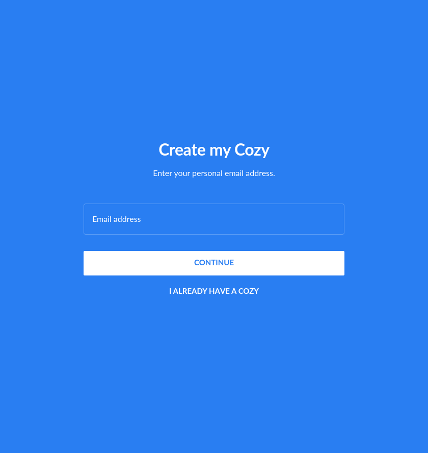
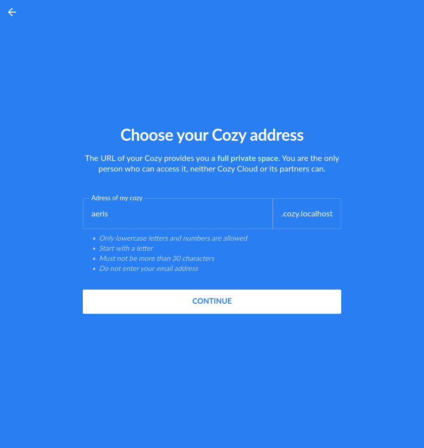
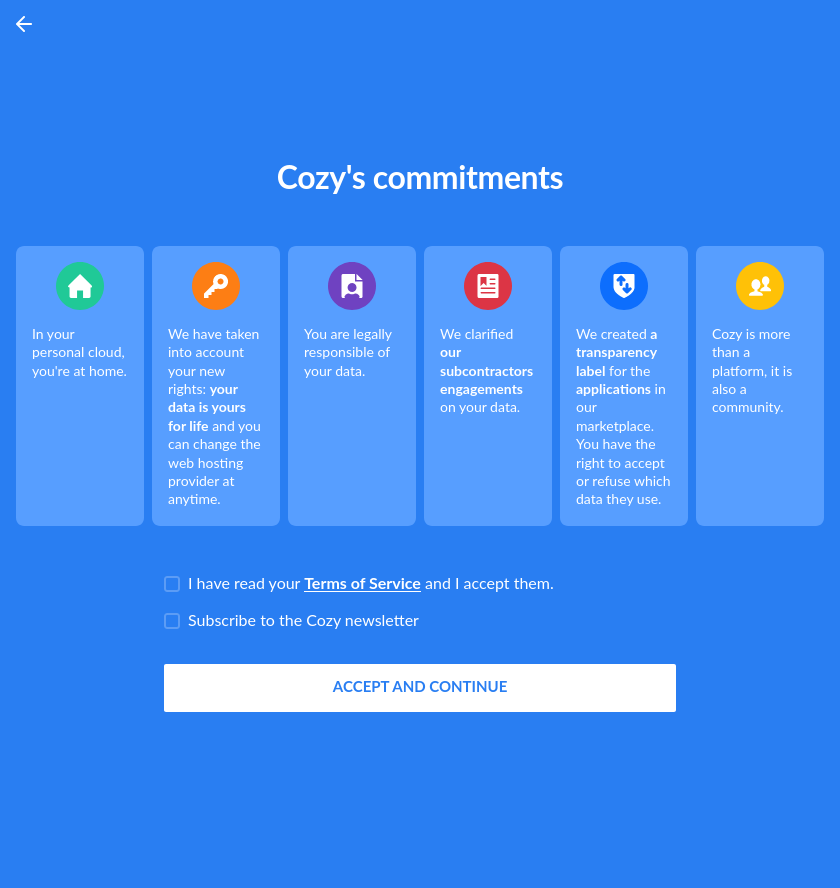
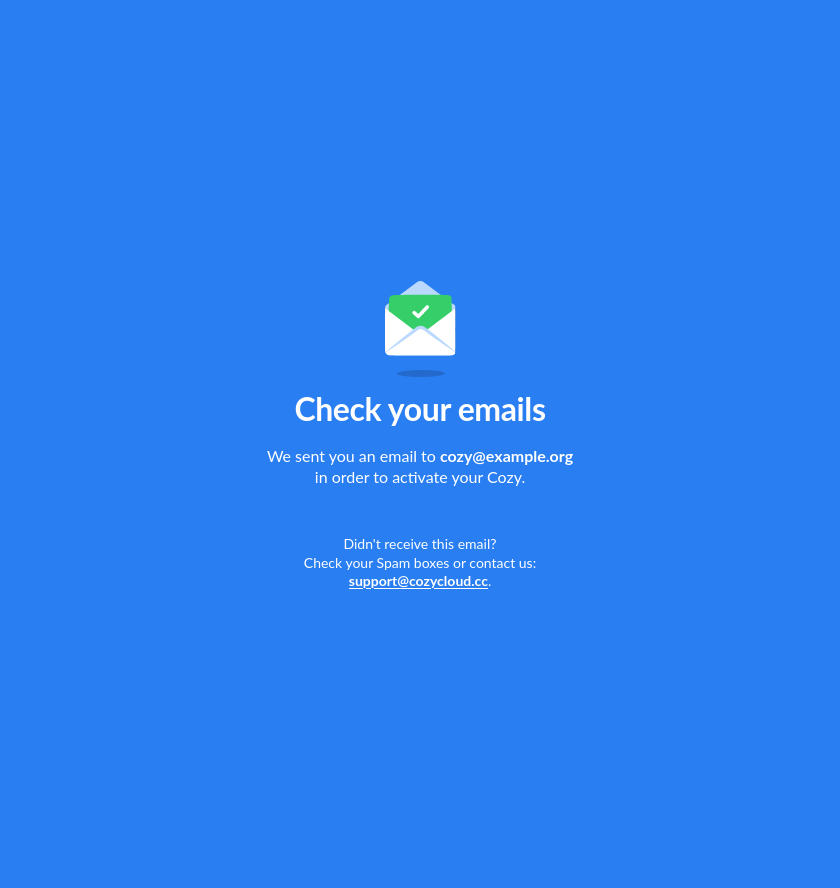
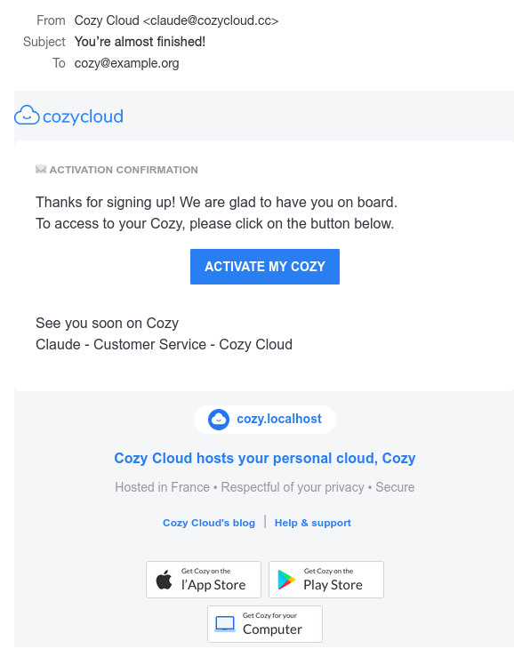
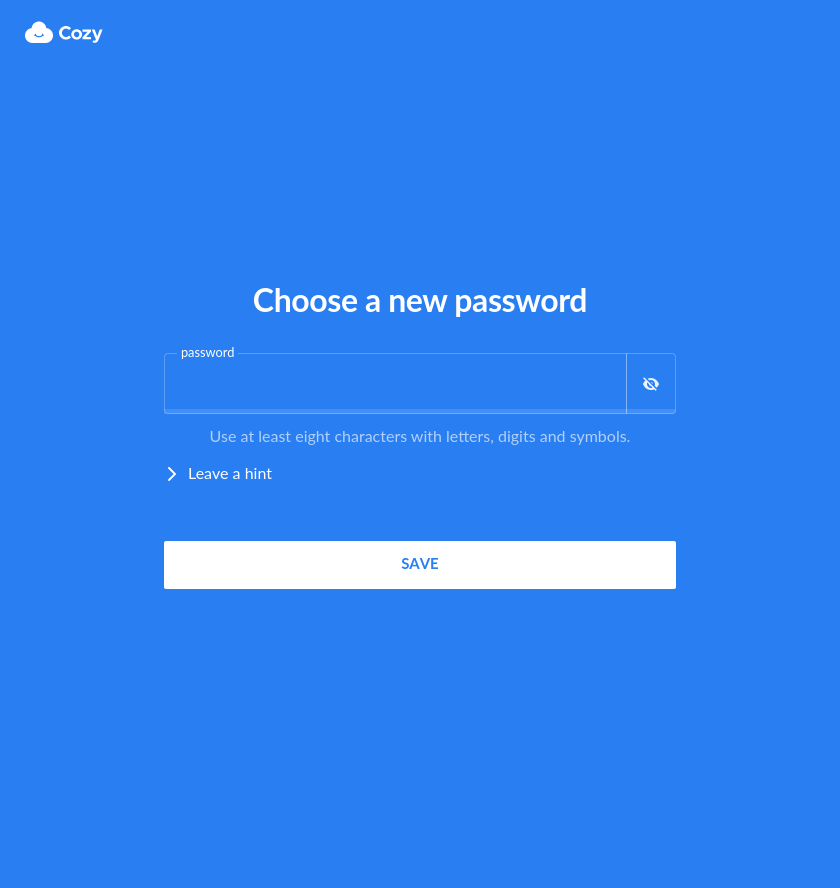

# Cloudery

This documentation explain how to use our Cloudery API to create and manager your own Cozy.
Code example is provided for Python language, but this can be easily ported to any other langage, there is no real dependency to the language by itself.

Full API documentation is provided [here](https://cloudery.cozycloud.cc/api/) and this documentation is only about some standard usages examples.

## Creating a Cozy

### From web

Send your user on `/v2/{partner}/onboard`. You can customize some onboarding parameters with URL query, see [the documentation](https://cloudery.cozycloud.cc/api/#tag/instances/paths/~1{partner}~1onboard/get).
Our Cloudery will onboard the user throught differents steps to gather required informations and then create the instance.






Your user will received an email at the end, with an activation link to click to go on the initial passphrase definition.




### From API called by a client app.

You can create an instance directly from our API.

Call the [`POST /api/public/instances`](https://cloudery.cozycloud.cc/api/#tag/public/paths/~1public~1instances/post) route, then poll the [`GET /api/public/workflows/{id}`](https://cloudery.cozycloud.cc/api/#tag/public/paths/~1v1~1public~1workflows~1{uuid}/get) til the end of the creation.
You need to have a public token to authenticate you on those endpoints.

```python
import requests

token = 'xxxx'
headers = { 'Authorization': 'Bearer ' + token }

base_url = 'https://manager.cozycloud.cc/api'
response = requests.post(base_url + '/v1/instances', headers=headers, json={
                            'offer': 'some_offer',
                            'email': 'foo@example.org',
                            'slug': 'foo', 'domain': 'example.org'
                        })
response = response.json()
workflow = response['workflow']

while True:
    response = requests.get(base_url + '/v1/workflows/' + workflow, headers=headers)
    response = response.json()
    status = response['status']
    if status in ['succeeded', 'failed', 'stopped']:
        break
```

In case of success, your user will receive an email to continue the onboarding after he clicks on the activation link on it to go on the initial passphrase definition.


### Special cases

#### Mobile onboarding

For mobile onboarding, you can use the `redirect` parameter of the web or API endpoint to specify an universal link.
After mail activation, your user will be redirected to `{universal_link}?fqdn={fqdn}&registerToken={registerToken}` instead of to it instance (usually `https://{fqdn}/?registerToken={registerToken}`).

> ⚠️ This kind of activation will break if the user use a desktop mail client or webmail or more generally any environment not able to handle universal link. The link into the email is a standard web one but the final redirection after the cloudery activation will be an universal link redirection.
