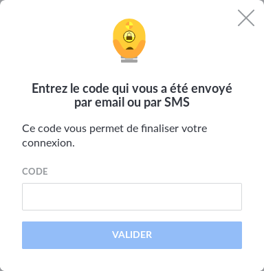

You have successfully developped your connector but you realize that some accounts need two factor
authentication (2FA) to work.

Here is how you can add this to your connector

## 2FA detection

Every target website being different, you will have to develop it yourself. Some websites return a
specific url, some others display a special html content. Take a look at [the github connector](https://github.com/konnectors/github) for
real life example.

## Home Automatic Successul Login deactivation

By default, the "Home" application will suppose the connector's login is a success after 8s, which is bad when
your connector needs to wait for the user to send his code.

For this, call :

```javascript
await this.deactivateAutoSuccessfulLogin()
```

where `this` is your connector instance.

And when the 2FA process is finished, call :

```javascript
await this.notifySuccessfulLogin()
```

To notify the "Home" application that the login process is a success.

## Request a 2FA code from the user
```javascript
const code = await this.waitForTwoFaCode()
```



Will display this popup in "Home" application and return the 2FA code when ready.
It will handle error messages on timeout and won't request a 2FA code if the connector is run in
background and throw the `USER_ACTION_NEEDED.TWOFA_EXPIRED` error instead, which will automatically
display an appropriate message in the "Home" application.

You can get more information [in the documentation](https://docs.cozy.io/en/cozy-konnector-libs/api/#basekonnectorwaitfortwofacode-promise)

When you get your 2FA code, send it to the target website the way it wants.

## What is the point of handling 2FA code if my connector asks it every time it is run ?

Most of the time, a website will request a 2FA code one time and keep you logged in with the cookie
session for a long time. Your connector will have to maintain a session between each run.

For this, you have the [CookieKonnector](https://docs.cozy.io/en/cozy-konnector-libs/api/#cookiekonnector) which does most of the work.

Sadly, it is possible that a webservice does not allow you to keep a session long enough between each
run, and this is the only case where the connector must be run by the user manually each time.
Did you check if the targeted service offers an api ?

## Technical details


Some connectors using this feature: [Amazon](https://github.com/konnectors/amazon), [Github](https://github.com/konnectors/github)
