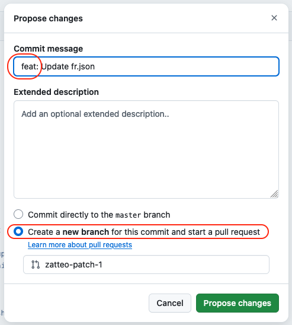

# Translate Apps

## Modify a wording on a Cozy app

Translation files are in JSON format and stored in the `src/locales` folder of Cozy apps.

### With the web interface

1. Go to GitHub on the translation file concerned

e.g.: [https://github.com/cozy/cozy-drive/blob/master/src/locales/fr.json](https://github.com/cozy/cozy-drive/blob/master/src/locales/fr.json)

2. Click on the pencil icon at the top right of the file content

3. Make your changes

4. Click on “Commit changes...”

- Start the commit message with “feat: ”.
- Select “Create a new branch”.

5. Click on “Propose changes”.

6. Wait until the CI is green and says “All checks have passed”.

7. Merge the Pull Request (PR)

If you're in a hurry, check the “Merge without waiting for requirements to be met (bypass branch protections)” box so you don't have to wait for another person to validate the PR.

To merge the PR, click on “Rebase and merge”.

---

After a few minutes, your changes should arrive on the dev channel.
